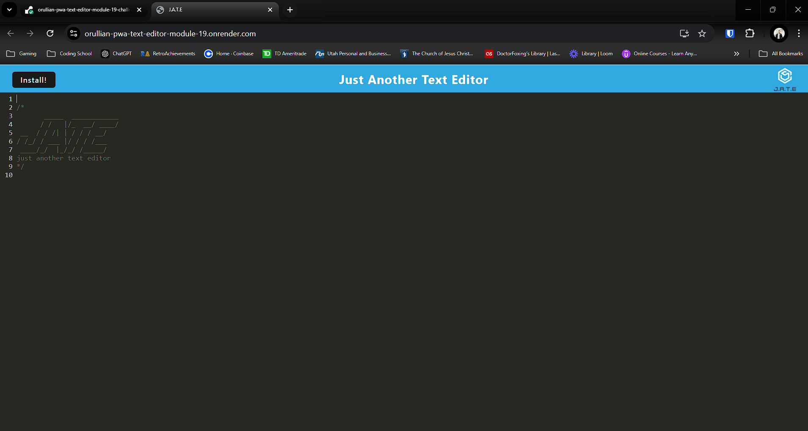
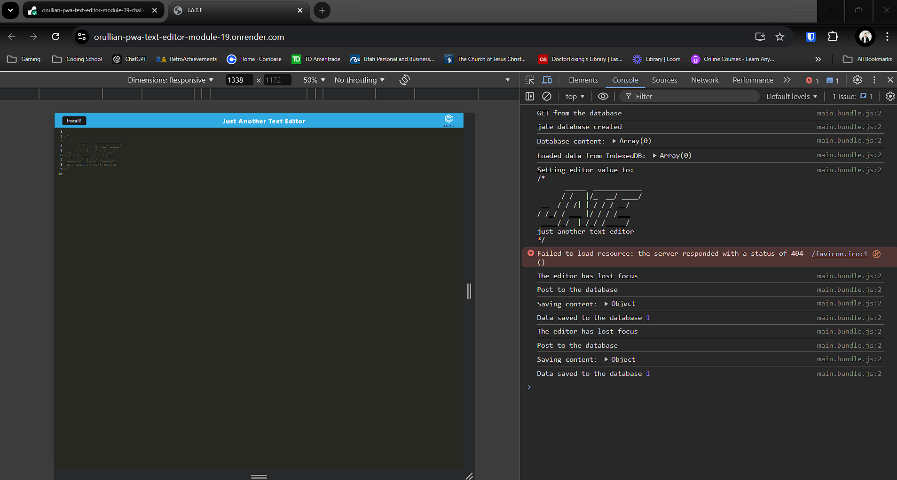
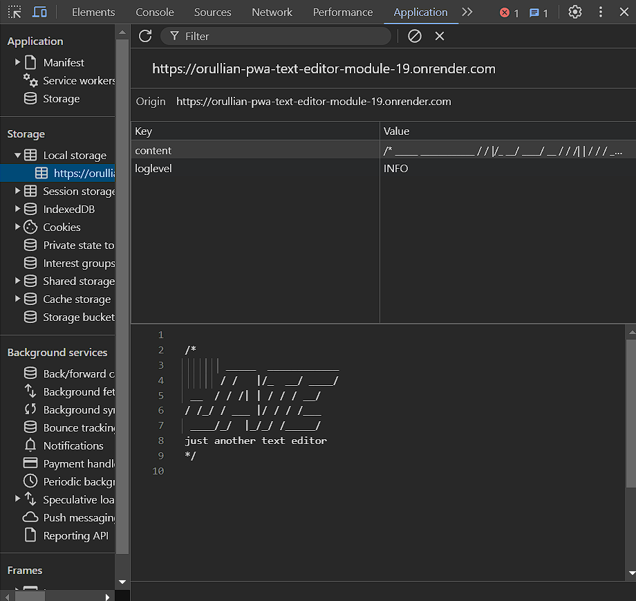
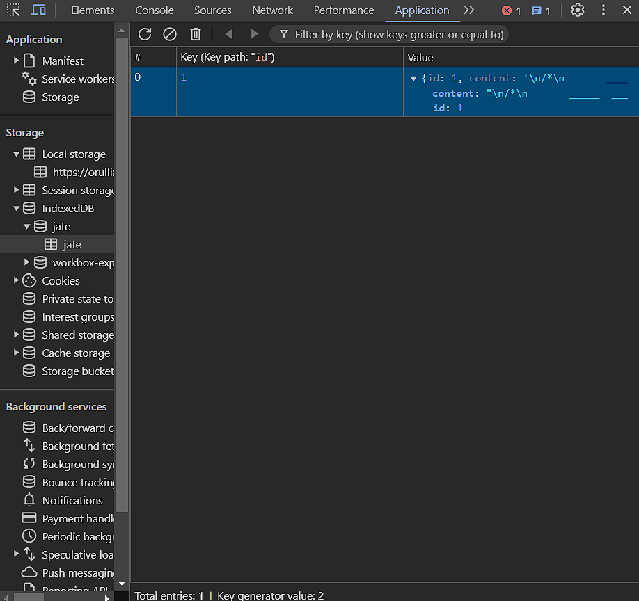
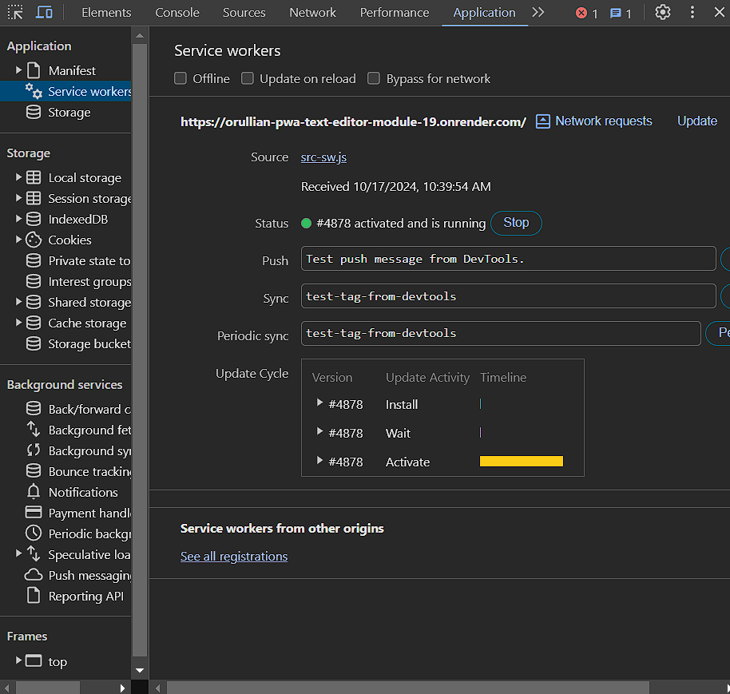

# PWA Text Editor

Pictures showing application and features:

## Description

This Progressive Web Application (PWA) Text Editor is a feature-rich, offline-capable text editor designed to demonstrate advanced front-end concepts like data persistence, modular JavaScript bundling with Webpack, and the use of Service Workers.

The project emphasizes a seamless user experience with multiple layers of data redundancy through IndexedDB, local storage, and browser caching to ensure functionality both online and offline. The app is bundled using Webpack, which generates an HTML file, a manifest, and a Service Worker that caches static assets and pages.

This project aligns with best practices in modern web development, highlighting the power of PWAs and progressive enhancement techniques that ensure the application runs smoothly across various devices and browsers, even in limited connectivity environments.

## Usage

Follow these steps to run the application locally:

1.  Install Dependencies

        npm install

2.  Start the Application

    From the root directory, start the development server:

        npm run start

    This will start both the backend server and client-side application. The server will serve the bundled files from Webpack.

3.  Open in Browser

    Visit `http://localhost:3000` in your browser to access the text editor.

4.  Install the App

    -   Click on the Install button to install the application on your desktop

    -   Once installed, the application can be launched like a native app without the need for an internet connection

Follow these steps to run the application from the website:

1.  Open in browser

    Visit `https://orullian-pwa-text-editor-module-19.onrender.com`

2.  Install the App

    -   Click on the Install button to install the application on your desktop

    -   Once installed, the application can be launched like a native app without the need for an internet connection

## Features and Functionality

This text editor PWA satisfies the following Acceptance Criteria:

- Modular File Structure

    - A client-server folder structure ensures that both frontend and backend components are organized logically.

- Bundling with Webpack

    - JavaScript files are bundled using Webpack, with plugins that generate the HTML file, Service Worker, and manifest.json.

- Offline Capability via IndexedDB

    - When the editor loads, it immediately initializes IndexedDB to store and retrieve content.

    - If you enter content and click outside the editor window, the text is saved automatically to IndexedDB.

    - When the application is reopened, it retrieves the saved content from IndexedDB, even if the browser was closed.

- Modern JavaScript Support

    - Uses next-gen JavaScript features like ES6 modules, ensuring compatibility with modern browsers.

- Service Worker with Workbox

    - A Service Worker registers upon loading the application, pre-caching essential assets and pages.

    - Static assets are cached for fast load times, ensuring the PWA works offline or with limited connectivity.

## Credits

### Third-Party Assets

- Webpack

- IndexedDB

- Service Worker

- Node.js/Express

Starter code has been provided by Southern Methodist University Coding Bootcamp.

The repo for the original code can be found here: [Original Code Repo](https://git.bootcampcontent.com/Southern-Methodist-University/SMU-VIRT-FSF-PT-05-2024-U-LOLC/-/tree/main/19-PWA/02-Challenge/Develop?ref_type=heads)

This project is part of an ongoing coding bootcamp